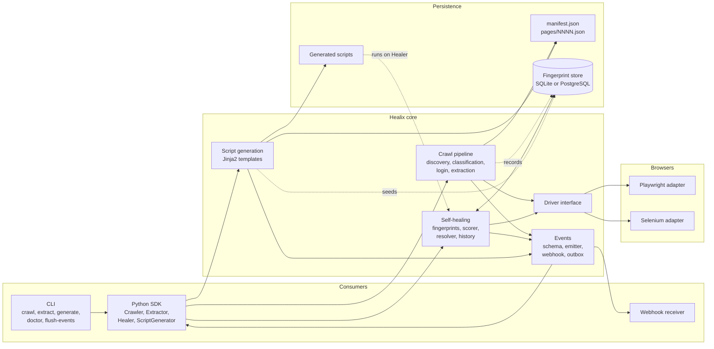
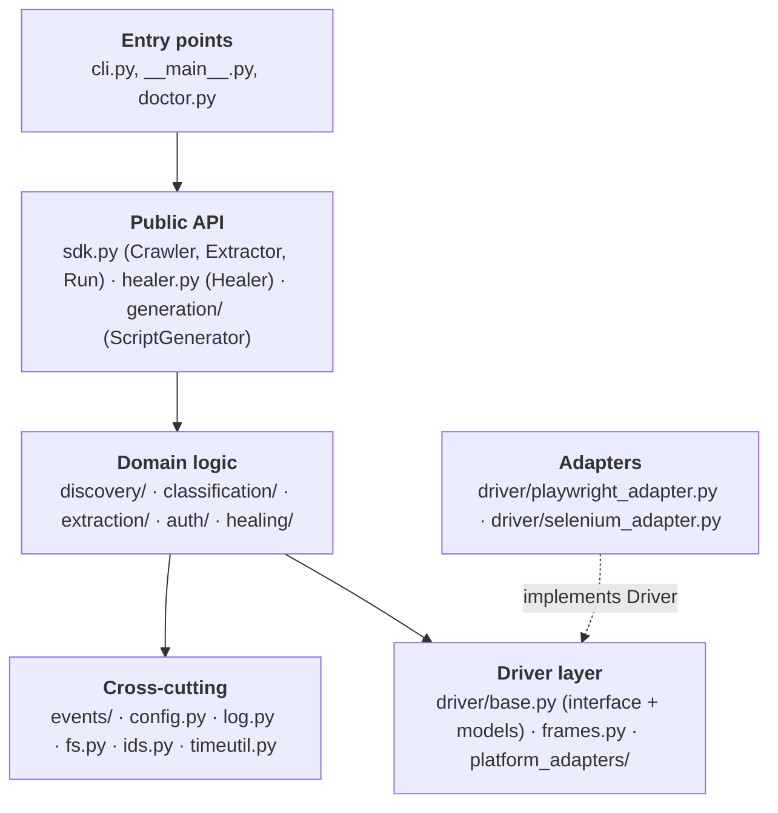
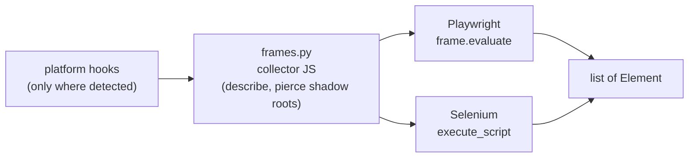
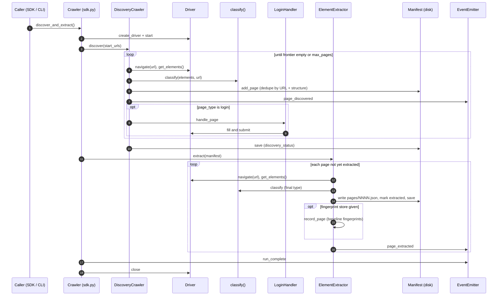
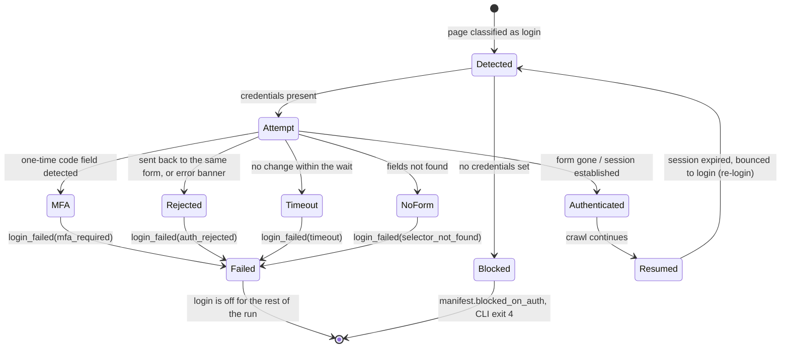
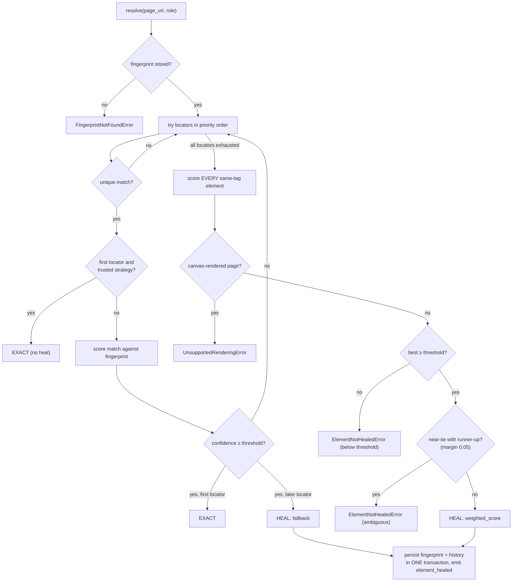
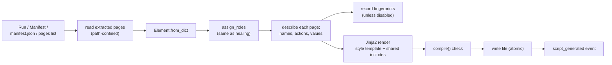
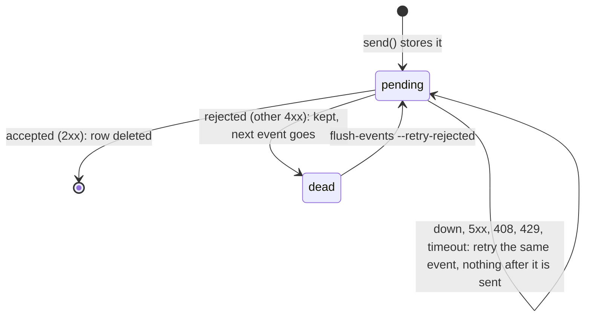

# Healix architecture

How Healix is built: what each part is for, how data moves between the parts, and where the
lines are that must not be crossed. It describes the code as it is. For how to *use* Healix see the
[README](README.md); for how to contribute see [CONTRIBUTING.md](CONTRIBUTING.md).

- [1. What Healix is](#1-what-healix-is)
- [2. Design decisions that are fixed](#2-design-decisions-that-are-fixed)
- [3. The big picture](#3-the-big-picture)
- [4. Layers and dependency rules](#4-layers-and-dependency-rules)
- [5. Package map](#5-package-map)
- [6. Core data models](#6-core-data-models)
- [7. The driver layer](#7-the-driver-layer)
- [8. Universal capabilities](#8-universal-capabilities)
- [9. Platform adapters](#9-platform-adapters)
- [10. The crawl pipeline](#10-the-crawl-pipeline)
- [11. Page classification](#11-page-classification)
- [12. Authentication](#12-authentication)
- [13. Self-healing](#13-self-healing)
- [14. Script generation](#14-script-generation)
- [15. Integration surface: SDK, CLI, events](#15-integration-surface-sdk-cli-events)
- [16. Configuration and secrets](#16-configuration-and-secrets)
- [17. Files and databases on disk](#17-files-and-databases-on-disk)
- [18. Cross-cutting concerns](#18-cross-cutting-concerns)
- [19. Testing architecture](#19-testing-architecture)
- [20. Packaging and release](#20-packaging-and-release)
- [21. Extension points](#21-extension-points)
- [22. Boundaries and known limits](#22-boundaries-and-known-limits)

---

## 1. What Healix is

Healix is a pure-Python library (about 8,700 lines, Python 3.10+) that:

1. **discovers** every reachable page of a website;
2. **classifies** each page (`login`, `form`, `list`, …) with rules, no LLM;
3. **extracts** every element of every page, at full detail, to JSON;
4. **logs in** automatically when it meets a login page;
5. **self-heals** element locators: it remembers what an element looked like and finds it again
   after the page changes;
6. **generates** Playwright or Selenium scripts whose every step heals.

It runs on two browser backends (Playwright, Selenium) behind one interface, and is driven three
ways that share one event schema: a Python SDK, a command line, and webhooks.

```
input:   a run config (JSON, no secrets) + credentials in .env
output:  manifest.json + one JSON file per page + a fingerprint database + generated scripts
```

## 2. Design decisions that are fixed

These were decided up front and are enforced by the structure of the code and by tests. Changing
one is a new decision, not a refactor.

| Area | Decision | Where it shows |
|---|---|---|
| Language | Pure Python. No compiled core, no second language. Other languages are served by the CLI and webhooks. | whole package |
| Backends | Playwright first; Selenium a second adapter behind the same `Driver` interface. | `driver/` |
| Browser isolation | Only the adapter modules import `playwright` or `selenium`. | [§4](#4-layers-and-dependency-rules) |
| Crawl model | Two stages: discovery finds every page (no depth cutoff, only a `max_pages` ceiling), then extraction walks the manifest one page at a time. | `discovery/`, `extraction/` |
| Classification | Rule-based only. Deterministic, no network, no LLM call anywhere in crawl/classify/extract. | `classification/rules.py` |
| Extraction depth | Every element captures maximum detail at extraction time. Nothing is deferred to a second pass. | `driver/frames.py` |
| Generic first | Iframes, shadow DOM and id normalization are generic. Vendor code only *adds* signal. | [§8](#8-universal-capabilities), [§9](#9-platform-adapters) |
| Secrets | `.env` only. The run config rejects credential-looking keys, so it is always safe to commit. | `config.py`, `auth/` |
| Login | A page classification (`login`), not a config step. MFA aborts with `login_failed`; never hangs, never retries a password. | `auth/` |
| Resumability | The manifest tracks `pending / extracted / failed` per page; the same `run_id` resumes. | `discovery/manifest.py` |
| Healing | Weighted, threshold-gated (default 0.5); weak or ambiguous matches are rejected, never used. Canvas UI fails cleanly. | `healing/` |
| Fingerprints | SQLite by default, PostgreSQL optional; keyed by `(page_url, element_role)`; heal history kept. | `healing/store.py` |
| Sequential | Extraction is one page at a time so fingerprint writes stay ordered. | `extraction/` |
| One schema | SDK `on_event` and CLI `--webhook-url` emit identical payloads. | `events/` |
| One credential | A single credential per run; multi-role crawling is out of scope. | `auth/` |

## 3. The big picture



The shape to remember: **everything above the driver is written once, against `Driver`.** A backend
is a plug. The pipeline and the healer share the same `Element` and `Fingerprint` models, and the
generated scripts run on the same `Healer` the SDK exposes.

## 4. Layers and dependency rules



The rules. The first two are enforced by `tests/test_architecture.py`, which scans the source; the
rest by tests of the behaviour they describe and by review:

1. **Only the two adapter modules import a browser library.** Discovery, classification, extraction,
   auth, healing and generation never import `playwright` or `selenium`. `healix doctor` reaches a
   browser only through each adapter's `diagnose()`. *Generated scripts* reach a browser only through
   `healix.driver`.
2. **Domain logic depends on `Driver`, `Element` and `Fingerprint`, never on an adapter.** The
   factory (`driver/factory.py`) and the lazy exports in `driver/__init__.py` are the only modules
   that name an adapter module. Domain packages also never import the CLI, the SDK or `Healer`
   above them; the one exception is `generation/`, which accepts an SDK `Run` as its input.
3. **Adapters are optional installs.** `import healix` works with neither library present;
   `create_driver` raises `BackendUnavailableError` with the install command if one is missing.
4. **Classification and scoring are pure functions of `Element` data** (plus a URL). They never
   touch the browser, which is why they behave identically on either backend and are unit-testable
   without one.
5. **Every event type is defined in `events/schema.py` and in the README table together**; a test
   keeps them in step.
6. **No logic in the public wrappers.** `Crawler` and `Extractor` assemble parts; `cli.py` calls the
   SDK, so a CLI run is an SDK run.

## 5. Package map

| Path | Responsibility |
|---|---|
| `healix/__init__.py` | Public exports (`Crawler`, `Extractor`, `Healer`, `ScriptGenerator`, errors), `__version__`. |
| `sdk.py` | `Crawler`, `Extractor`, `Run`: wire config, browser, login, events, fingerprint store around the pipeline. |
| `healer.py` | `Healer`: public entry to self-healing (learn, resolve, click, write, history, report). |
| `cli.py`, `__main__.py` | `healix crawl / extract / generate / doctor`; exit codes; `.env` loading. |
| `doctor.py` | Environment checks for `healix doctor`. |
| `config.py` | `RunConfig`: parse and validate the run JSON; reject secrets. |
| `driver/base.py` | `Driver` ABC, `Element`, `Frame`, `SkippedFrame`, `Target`, `ElementNotFoundError`. |
| `driver/frames.py` | In-page JavaScript (collector, queries) and `collect_elements`, `walk_frames`. |
| `driver/settle.py` | `wait_until_quiet`: the shared "page stopped changing" wait, with no browser import. |
| `driver/playwright_adapter.py` | `PlaywrightDriverAdapter`. |
| `driver/selenium_adapter.py` | `SeleniumDriverAdapter`. |
| `driver/factory.py` | `create_driver`, `diagnose_backend`, `BackendUnavailableError`. |
| `driver/diagnose.py` | `BackendReport` (what doctor learns about a backend). |
| `platform_adapters/` | `PlatformAdapter`, `sap_ui5`, `salesforce_lwc`, `ADAPTERS`, `detected_platform`. |
| `discovery/crawler.py` | `DiscoveryCrawler`, `DiscoveryConfig`, `Scope`: the link walk. |
| `discovery/manifest.py` | `Manifest`, `ManifestPage`, `normalize_url`, `template_key`, `structural_hash`. |
| `classification/rules.py` | `classify`, `classify_page`, `is_oauth_url`; one rule per page type. |
| `extraction/element_extractor.py` | `ElementExtractor`, `ExtractionConfig`; writes page JSON; records fingerprints. |
| `auth/forms.py` | Pure detection of login forms, MFA and error banners. |
| `auth/login_handler.py` | `LoginHandler`, `Credentials`: fill, submit, SSO, re-login. |
| `healing/fingerprint.py` | `Fingerprint`, `LocatorSpec`, locator priority. |
| `healing/roles.py` | Stable element role names (`textbox:username`). |
| `healing/scorer.py` | Weighted similarity; `WEIGHTS`, thresholds. |
| `healing/resolver.py` | `Resolver`: locators → verify → score → gate → heal. |
| `healing/history.py` | `HealRecord`, churn-vs-regression diff, `churn_report`. |
| `healing/baseline.py` | `record_page`: fingerprint a page's elements. |
| `healing/store.py` | `FingerprintStore` ABC, `SQLiteFingerprintStore`, `open_store`. |
| `healing/postgres_store.py` | `PostgresFingerprintStore`. |
| `generation/script_writer.py` | `ScriptGenerator`, `GeneratedScript`. |
| `generation/templates/` | `pom.j2`, `test.j2`, `action.j2`, shared `_imports.j2`, `_session.j2`. |
| `events/schema.py` | Event types, `EVENT_DATA_FIELDS`, `Event`, `make_event`. |
| `events/emitter.py` | `EventEmitter`: one payload to every sink. |
| `events/webhook.py` | `WebhookSender` (best-effort, in memory), and `post_with_retries`: one signed POST with retries, shared by both senders. |
| `events/outbox.py` | `Outbox` (the SQLite file), `DurableWebhookSender`, `open_sender`. Opt-in durable delivery. |
| `log.py` | logquill-based logging. |
| `ids.py` | `normalize_id`. |
| `fs.py`, `timeutil.py` | Atomic file writes; UTC timestamps. |

## 6. Core data models

Three models cross every boundary. Learn these and the rest reads easily.

### `Element` (`driver/base.py`)

One DOM element, captured with maximum detail. This is the extraction schema.

```json
{
  "tag": "input",
  "id": "user-4471",
  "id_normalized": "user-{n}",
  "name": "username",
  "classes": ["form-control"],
  "attributes": {"type": "text", "data-testid": "login-username", "aria-label": "Username"},
  "text_content": null,
  "computed": {"visible": true, "enabled": true, "bounding_box": {"x": 120, "y": 240, "width": 200, "height": 32}},
  "xpath": "/html[1]/body[1]/form[1]/input[1]",
  "css_selector": "html > body > form > input:nth-of-type(1)",
  "iframe_path": ["main"],
  "shadow_path": [],
  "platform_signal": null,
  "dom_context": {"parent_tag": "form", "parent_id": "login-form", "sibling_index": 1,
                  "nearby_label_text": "Username", "tag_path": "…"}
}
```

`iframe_path` is the chain of frames from `"main"`. `shadow_path` lists the CSS selector of each
shadow host, outermost first (empty for light-DOM elements); `css_selector` is complete and pierces
shadow roots. A password input's markup `value` is redacted at collection time.

### `Fingerprint` (`healing/fingerprint.py`)

A remembered element: the same fields as `Element` plus `page_url` and `element_role`. Its key is
`(page_url, element_role)`. It yields **locators in priority order**:

```
stable test attribute → id → name → aria-label → css → xpath → normalized id → text
```

Each is a backend-neutral `LocatorSpec(strategy, kind, value)` (`kind` ∈ `css`, `xpath`,
`id_pattern`, `text`) that each adapter translates into its native locator.

### `Manifest` / `ManifestPage` (`discovery/manifest.py`)

The run's ledger, saved as `manifest.json`:

```json
{
  "run_id": "bebd30b63d35",
  "start_urls": ["https://example.com/"],
  "discovery_status": "complete",
  "pages_discovered": 4, "pages_extracted": 4,
  "platform_detected": null,
  "blocked_on_auth": false,
  "pages": [{"url": "…", "structural_hash": "…", "page_type": "list",
             "status": "extracted", "output_file": "pages/0001-….json",
             "variant_urls": [], "error": null}]
}
```

`discovery_status` is one of `in_progress`, `complete`, `max_pages_reached`, `interrupted`. Page
`status` is `pending`, `extracted` or `failed`. The manifest indexes pages by URL and by structural
hash and is written atomically (temp file + rename).

## 7. The driver layer

### The interface

```python
class Driver(ABC):
    def start(self) / close(self)            # optional lifecycle; also a context manager
    current_url -> str                        # after redirects
    navigate(url)
    settle()                                  # bounded wait for navigation/network to quiet
    get_elements(*, iframe_traversal=True) -> list[Element]
    get_frames() -> list[Frame]               # depth-first, main first
    find(fingerprint) -> Element              # locators in priority order
    locate(spec, fingerprint) -> Element|None # ONE strategy; None = no match or ambiguous
    click(target) / write(text, into)         # target is an Element or a Fingerprint
    screenshot() -> bytes
```

`locate` exists so the healer can see *which* strategy resolved; `find` is `locate` tried down the
priority list. `Frame.handle` carries the adapter's native frame object.

### One collector, run everywhere

`driver/frames.py` holds the in-page JavaScript that describes elements. It is written once and run
by each backend through its own "evaluate" call (Playwright `evaluate`, Selenium `execute_script`):



That is why both backends extract identical elements. A parity test compares every element, every
locator of every element, and whole crawls between the two.

### The adapters

| | `PlaywrightDriverAdapter` | `SeleniumDriverAdapter` |
|---|---|---|
| Browser | Chromium (`browser="chromium"`) | Chrome (Firefox is exercised by a non-blocking CI job; Edge is accepted, untested) |
| Lifecycle | Launches and owns a browser, or wraps a `page` you pass in | Launches and owns a browser, or wraps a `webdriver` you pass in |
| Native selectors | Pierce open shadow roots and wait for actionability | Do not; the adapter uses in-page queries |
| Shadow / frames | Shared collector; native locators | Shared collector plus `QUERY_JS`, `TEXT_JS`, `IDS_JS`, `CHILD_FRAMES_JS` |
| Waiting | `navigate` waits for `load`; `settle` waits for any navigation in flight, then for network-idle, bounded by `settle_timeout_ms` (busy pages that never go idle simply time out). Opt-in `quiet_ms` (default 0) then also waits for no new resources or elements, inside the same budget | Heuristic `settle`: `readyState` complete, then no new resources or elements for `quiet_ms` (500), bounded by `settle_timeout_ms` |
| Acting | Playwright auto-waits | `click`/`write` retry up to `action_timeout_ms` (5 s) while the element is missing, covered, stale or not interactable; an ambiguous match fails immediately |
| Errors | Navigation retried up to 3 times if interrupted by a failed prior load | Browser error pages (`chrome-error://`, …) raise instead of being read as pages |
| Driver noise | none | `cd_frame_id_` (stamped by chromedriver) is scrubbed; unhandled prompts dismissed |

The quiet window is a heuristic on both backends: it watches the page's own resources and elements
(`ACTIVITY_EXPRESSION` in `driver/settle.py`, polled by `wait_until_quiet`), and WebDriver cannot see
a request still in flight, so a slow API call that outlasts `quiet_ms` can be missed. It exists on
Playwright because a page that renders from a timer, or from a script it starts itself, can pass
network idle and still be empty. Both knobs are configurable, from the run config too
(`crawl.extraction.settle_quiet_ms`, `null` meaning each backend's own default).

Selenium frame handling: a `_FrameRef` is the chain of `<iframe>` elements from the top document; a
`_frame` context manager switches into it and always back to default content.

### Factory and diagnostics

`create_driver(backend, *, headless, platform_detection, quiet_ms)` returns a not-yet-started driver, imports
the adapter lazily, and turns an `ImportError` into `BackendUnavailableError` with the install hint.
`diagnose_backend(backend)` (used by `healix doctor`) checks the package with `find_spec`, then calls
the adapter's own `diagnose()`, which reports the package version and whether a browser binary
exists, without launching anything.

## 8. Universal capabilities

Three capabilities are generic and built into the core, not per-vendor:

1. **Recursive iframe traversal.** After a page loads, `walk_frames` builds the same-origin frame
   tree from adapter callbacks, and `collect_elements` runs the collector in each frame, tagging
   every element with its `iframe_path`. This alone makes frame-heavy applications (Oracle EBS,
   ServiceNow) extractable. Cross-origin frames are skipped.
2. **Shadow DOM piercing.** The collector descends into every *open* shadow root and records
   `shadow_path`. Selenium's queries do the same in-page (one round trip per frame rather than one
   `getShadowRoot()` per host). Closed shadow roots are unreachable and skipped.
3. **Stable-ID normalization** (`ids.py`). `normalize_id` rewrites volatile id segments to
   placeholders using pattern rules: UUIDs → `{uuid}`, long hex fragments → `{hex}`, digit runs
   (including ADF-style `pt1:r1:0:` prefixes) → `{n}`. Both raw and normalized ids are stored; the
   `normalized_id` locator lets the healer find `user-{n}` when the raw id has changed.

## 9. Platform adapters

Thin, optional, and **additive only**. A `PlatformAdapter` is two pieces of JavaScript run inside
each frame by the shared collector:

```python
@dataclass(frozen=True)
class PlatformAdapter:
    name: str
    detect_js: str    # expression: is the platform present in this frame?
    signal_js: str    # (element) => object | null, run only where detection passed
```

| Adapter | Detected by | Signal added |
|---|---|---|
| `sap_ui5` | `window.sap.ui` | `control_id`, `control_type`, `is_control_root`, looked up through `data-sap-ui`, `getCore().byId` or `Element.getElementById` |
| `salesforce_lwc` | `$A`, `Aura`, or `data-aura-*` markers | `component` (tag), `is_component_host`, `aura_attributes` |

Guarantees: hooks are registered per frame only when detection passes; every hook is wrapped in
try/catch, so a broken or absent adapter changes nothing; the first adapter with a signal wins; the
signal is a dict with a `platform` key; extraction, classification and healing never *require* it
(the scorer records but does not weigh it). `crawl.extraction.platform_detection = "off"` strips all
signals and leaves `platform_detected` null; a test that disables every adapter must still pass.
`detected_platform(elements)` fills the manifest's `platform_detected`.

## 10. The crawl pipeline



### Stage 1: discovery (`discovery/crawler.py`)

A breadth-first link walk with **no depth limit**; it stops when the frontier is empty or
`max_pages` *visits* have been made. Links come from `Driver.get_elements()`, so anchors in
same-origin iframes and open shadow roots are found with no extra code.

- **Scope.** `same_domain` (host, ignoring a leading `www`) or `same_origin`. Non-page links
  (`.pdf`, images, `mailto:`, …) are ignored; a redirect out of scope is skipped, unless it is an
  identity provider during login.
- **Identity, two ways.** `normalize_url` lowercases the host, drops default ports, strips
  session/tracking parameters, sorts the query, removes trailing slash and fragment (a hash *route*
  `#/x` is kept, since it is the page). `structural_hash` hashes DOM *structure*, independent of
  text, so `/product/1` and `/product/2` on one template collapse to one manifest entry (their URLs
  are kept as `variant_urls`). Links are still followed from duplicates.
- **Template sampling.** `template_key` collapses volatile path segments. Once
  `template_sample_size` (default 3) URLs of one template have been visited, further ones are
  *deferred* to the end, never dropped, so a family of look-alike pages cannot use up `max_pages`
  ahead of distinct pages.
- **Ending.** `complete`, `max_pages_reached` (something was left in the frontier) or `interrupted`
  (the manifest is still saved in a `finally`). Load failures become `failed` entries.

### Stage 2: extraction (`extraction/element_extractor.py`)

Walks the manifest **one page at a time**: navigate → read every element → classify (final) → write
`pages/NNNN-slug.json` → mark `extracted` → **save the manifest** → next. The manifest is saved
after *every* page, so an interruption loses at most the page in flight. A page marked `extracted`
whose output file has disappeared is extracted again; failed pages are retried on the next run.

Sequential is deliberate: it keeps fingerprint writes ordered and keeps resumability simple. Do not
parallelize without revisiting the write-ordering assumption.

When a fingerprint store is provided, `healing.baseline.record_page` records a fingerprint for every
*healable* element as pages are extracted (mode `keep`: only new roles are added, so an existing
baseline is never silently overwritten; `refresh` overwrites deliberately).

### Resuming

`Crawler(config, run_id=…)` over the same output directory resumes: finished discovery is reused
(unless the earlier attempt was blocked on auth), and extraction continues from the first non-
`extracted` page. Without a `run_id`, an output directory that already holds a run raises
`RunConflictError` rather than overwriting it.

## 11. Page classification

`classification/rules.py` is deterministic: the same elements and URL always give the same answer.

- Each page type has a rule that awards weighted **signals** (weights sum to 1.0), so a score is
  explainable: `classify_page` returns which signals fired.
- A type is chosen when its score reaches `MIN_SCORE` (0.5). If several types score within
  `TIE_MARGIN` (0.15) of the best, the most specific wins, by `PRIORITY`:
  `modal, login, checkout, search, form, list, dashboard, detail, nav_shell`. This is how a login
  form (structurally also a small form) is called a login.
- Below `MIN_SCORE` the answer is `"unknown"`: an honest "no rule matched" beats a weak guess.
- Only **visible** elements vote, so templates and hidden panels do not.

| Type | Evidence used |
|---|---|
| `login` | password input + submit, login URL/text, OAuth redirect, SSO buttons |
| `dashboard` | KPI/summary widgets, charts, few inputs |
| `list` | repeating row structures (≥5), pagination controls |
| `detail` | single entity, mostly read-only key/value fields |
| `form` | high input-to-text ratio (≥0.3), submit/save button |
| `search` | search input, filters, results area |
| `checkout` | payment fields, steppers, checkout URL/text |
| `nav_shell` | mostly navigation, low input density |
| `modal` | dialog role, or overlay z-index (≥100) with enough height |

Discovery provides a provisional type; extraction re-classifies and writes the final one. The hook
is `classifier(elements, url) -> str`, defaulting to `classify`.

## 12. Authentication

There is no login configuration. When discovery or extraction lands on a page classified `login`,
`LoginHandler.handle_page` uses credentials from `WEBLIB_LOGIN_USERNAME` / `WEBLIB_LOGIN_PASSWORD`.



- `auth/forms.py` is **pure**: it finds the username, password and submit elements (optionally in an
  iframe or shadow root), MFA challenges and error banners from an `Element` list.
- **Never submits a password twice** per attempt; any failure ends login for the rest of the run;
  `max_logins` (3) bounds initial login plus re-logins, so an expiring session cannot loop.
- **SSO**: a "Sign in with…" button, redirect or POST-back, including identifier-first providers.
- **Trust guard**: credentials are typed only on in-scope pages or pages whose URL looks like an
  identity provider, judged by **host and path only** (a forged `?client_id=` establishes nothing).
- **Secrets discipline**: credentials are never logged, put in an event, or written to disk; the
  `Credentials` `repr` hides them; URLs in logs and events lose their query string.
- Wired in through the `Authenticator` protocol (`authenticator=` on `DiscoveryCrawler` and
  `ElementExtractor`), so both stages log in and re-log-in the same way.
- Failure emits `login_failed` with `url`, a `reason`, and a `screenshot_ref` (a path relative to the
  output directory, or null).

## 13. Self-healing

### Recording

A **role** names an element in a way that survives the page changing (`healing/roles.py`):
`kind:slug`, e.g. `textbox:login-username`, `button:sign-in`. The slug comes from the most stable
identity the element has (test id → aria-label → name → label → text → placeholder → …); duplicates on
a page are numbered in document order (`button:save#2`). Only *healable* elements get a role: visible,
interactive (input, button, select, textarea, links with an href, ARIA interactive roles) or carrying
a stable test attribute.

`record_page` turns each into a `Fingerprint` and stores it under `(normalize_url(page_url), role)`.

### Resolving



Two ideas carry the design:

- **A locator that matches something is not the same as matching the element.** Trusted strategies
  (`stable_attr`, `id`, `name`, `aria_label`) are accepted as they are when they are the *first* tried.
  Any other match (a later strategy, a positional css/xpath, or text) is **verified** against the
  fingerprint with the scorer and rejected if it does not clear the threshold.
- **The gate is a hard requirement.** The best candidate must reach the threshold (default 0.5) and
  must not be a near-tie with the runner-up. A weak or ambiguous match raises; it is never used.

### The scorer (`healing/scorer.py`)

Not a flat comparison. Signals are weighted by stability:

| Signal | Weight | Signal | Weight |
|---|---|---|---|
| stable test attribute | 0.25 | other attributes | 0.08 |
| name | 0.12 | DOM path | 0.08 |
| visible text | 0.12 | id (raw / normalized) | 0.04 |
| nearby label text | 0.12 | classes | 0.04 |
| aria-label | 0.10 | parent | 0.03 |
| | | sibling index | 0.02 |

Rules: candidates must have the fingerprint's **tag**. A signal **absent on either side is neutral**
(a developer stripping a test id does not make it a different element); a **different value** is a
mismatch. The score is the weighted mean of the *comparable* signals, **damped by how much evidence
there was** (comparable weight against `EVIDENCE_TARGET` 0.5), so a candidate comparable on only one
or two weak signals cannot score high. Volatile attributes (`style`, framework hash attributes,
`aria-expanded`, …) are never compared.

### The history (`healing/history.py`)

Every heal is a `HealRecord`: `kind` (`fallback` or `scored`), `strategy`, `confidence`, old and new
locator, old and new fingerprints, `change_kind`, `changed_fields`, `run_id`. `diff_fingerprints`
classifies each as:

- **churn**: the handles moved (ids, classes, test ids, name, DOM position), the element did not;
- **regression**: what the element *is* or what a user sees changed (tag, input type, role, or text /
  aria-label / placeholder / label that no longer resembles the old).

`churn_report` aggregates heals and regressions per element, so a team can tell routine selector
churn from a real UI change.

### The stores (`healing/store.py`, `postgres_store.py`)

`FingerprintStore` is the ABC: `get`, `put`, `put_if_absent`, `fingerprints`, `apply_heal`, `history`,
`close`. `open_store(target)` picks SQLite for a path, PostgreSQL for a `postgresql://` URL. Both run
the **same contract test suite**.

| | SQLite (default) | PostgreSQL |
|---|---|---|
| Install | stdlib | `healix[postgres]` (`psycopg`) |
| Tables | `fingerprints`, `healing_history`, `meta` | `healix_fingerprints`, `healix_healing_history`, `healix_meta` |
| JSON columns | text | `JSONB` |
| Schema creation | on open | on open, under an advisory lock (safe with many processes) |
| Password in URL | n/a | never logged; masked in `repr` and errors |

`apply_heal` writes the updated fingerprint and its history row **in one transaction**, so the store
can never hold a healed fingerprint without its audit record, or the reverse. Both carry a
`schema_version` and refuse a database written by a newer Healix.

### `Healer` (`healer.py`)

The public wrapper. It owns a browser and a store unless you pass them (an `ExitStack` closes only
what it opened), and offers `learn`, `resolve`, `click`, `write`, `history`, `report`. Healing an
element emits `element_healed`. It is a context manager.

### Canvas boundary

Canvas-rendered UIs (some Dynamics 365 canvas apps, Java-applet Oracle Forms) are not in the DOM, so
no locator can find anything. When healing fails on a page that is essentially one canvas or plugin
object with almost no controls (`looks_canvas_rendered`), the resolver raises
`UnsupportedRenderingError` rather than a low-confidence guess.

## 14. Script generation

`ScriptGenerator` (`generation/script_writer.py`) turns extracted pages into a runnable script. One
generator, three styles, two backends, not six generators.



| Style | Template | Output | Behaviour |
|---|---|---|---|
| `pom` | `pom.j2` | `pages_<backend>.py` | A class per page; `open()`, `fill_*`, `click_*`, `locate_*` methods; `session()` |
| `test` | `test.j2` | `test_healix_<backend>.py` | pytest; per page: assert address, then each element found, visible, and enabled (if it was). Types and clicks nothing. |
| `action` | `action.j2` | `actions_<backend>.py` | Per page with something to fill: write text inputs, click one submit. No assertions. |

`_imports.j2` and `_session.j2` are shared: `session()` opens the adapter for the chosen backend and a
`Healer` on the fingerprint database. The backend only changes which adapter that is.

Design points:

- **Self-healing comes from `Healer`.** Every step names an element by its role, not a locator, and
  runs through `Healer`, so a generated script heals exactly like the SDK does. This is why generated
  code needs `healix` installed at runtime.
- **Names are derived and made unique**: class names from the URL path (`/orders/new` → `OrdersNewPage`,
  digit-leading → `Item123Page`), method names from roles (`click_sign_in`, `click_save_2`).
- **Actions**: text/search inputs that are enabled and not read-only are filled; buttons, links,
  checkboxes and radios are clicked (in `pom`); a submit button is chosen by `type=submit` or label
  text; everything else is `locate_*`. Sample values follow the input type; a login page's username
  and password come from the environment.
- **Safety**: all page text is emitted through one filter (`_literal`, JSON-style double-quoted
  strings) so hostile page content cannot inject code; page-type text is sanitized; no attribute values
  are copied; **no credential or database URL is ever written**: a `postgresql://` database is read
  from `HEALIX_FINGERPRINT_DB`. Output is deterministic. Page files are read only from inside the
  output directory (path traversal is refused). The rendered source is `compile()`d before it is
  returned.
- **Fingerprints**: generating records them into the chosen database (mode `keep`) so a fresh script
  has a baseline; with `--no-record`, it warns if a local database has none for the scripted pages.
- **Limits**: pages with more than `max_elements_per_page` (200) actionable elements are truncated
  and counted; pages that are not `extracted` are skipped with a reason.

## 15. Integration surface: SDK, CLI, events

All three share one event schema and one code path.

### SDK

| Class | Purpose |
|---|---|
| `Crawler(config, *, run_id, on_event, webhook_url, webhook_outbox, driver, credentials, auto_login, fingerprint_store, …)` | `.discover()`, `.discover_and_extract()` → `Run` |
| `Extractor(config=None, …)` | `.extract(manifest)` over an existing manifest, resumably |
| `Healer(store, *, driver, backend, threshold, ambiguity_margin, on_event, …)` | record fingerprints; resolve / click / write with healing; history |
| `ScriptGenerator(source, *, base_dir, fingerprint_db, …)` | `.to_playwright(style)`, `.to_selenium(style)`, `.generate(backend, style)` |
| `Run` | `run_id`, `pages`, counts, `platform_detected`, `blocked_on_auth`, `manifest_path`, `summary()` |

`Crawler` and `Extractor` share a private `_Runner` whose `_session` context manager builds a
started driver (unless you pass one), an optional webhook sender, an optional fingerprint store, and
an `EventEmitter`, and tears them down in the right order. A driver or store you pass in stays yours.
The SDK never calls `sys.exit` and does not read `.env` (the CLI does).

Errors are ordinary exceptions:

```
ValueError          ConfigError · RunConflictError · EventError · GenerationError
RuntimeError        BackendUnavailableError · StoreError
LookupError         ElementNotFoundError
                      └─ ElementNotHealedError (also a HealingError)
                    FingerprintNotFoundError (also a HealingError)
Exception           HealingError
                      ├─ FingerprintNotFoundError
                      ├─ ElementNotHealedError
                      └─ UnsupportedRenderingError
```

### CLI

```
healix crawl    --config C [--output DIR] [--run-id ID] [--discover-only] [--webhook-url U]
                [--webhook-outbox P] [--headed] [--no-login] [--fingerprint-db P] [--json]
                [--log-level L]
healix extract  --manifest M [--config C] [same flags]
healix generate --input M [--backend playwright|selenium] [--style pom|test|action]
                [--output DIR] [--fingerprint-db P] [--no-record] [--webhook-url U]
                [--webhook-outbox P] [--json]
healix flush-events --outbox P --webhook-url U [--timeout S] [--retry-rejected] [--json]
healix doctor   [--launch] [--json]
```

| Exit | Meaning |
|---|---|
| 0 | success |
| 1 | runtime error (for `doctor`: no usable backend) |
| 2 | usage or configuration error, including a run conflict |
| 3 | finished, but some pages failed |
| 4 | blocked on authentication |
| 130 | interrupted; progress saved, resume with `--run-id` |

The CLI loads `.env` from the working directory and goes through the SDK, so a CLI run emits exactly
the events an SDK run does. Logs go to stderr; program output to stdout.

### Events (`events/`)

Envelope: `{"event", "run_id", "timestamp", "data"}`. `data` has exactly the fields for its type, no
more, no fewer; `make_event` validates this and rejects unknown types and extra or missing keys.

| Event | Emitted by | `data` |
|---|---|---|
| `page_discovered` | discovery, once per new manifest entry | `url`, `page_type` (provisional), `structural_hash` |
| `page_extracted` | extraction, once per page written | `url`, `page_type`, `element_count`, `output_file` |
| `element_healed` | `Healer`, each accepted heal | `element_key`, `old_locator`, `new_locator`, `strategy_used`, `confidence_score`, `page_url` |
| `script_generated` | `ScriptGenerator`, once per script | `backend`, `style`, `file_path` (null if not written), `element_count` |
| `run_complete` | `Crawler` / `Extractor`, last | `pages_discovered`, `pages_extracted`, `platform_detected`, `manifest_path` |
| `login_failed` | `LoginHandler`, once per failed login | `url` (no query string), `reason`, `screenshot_ref` |

`reason` is one of `mfa_required`, `timeout`, `selector_not_found`, `auth_rejected`.

**Delivery.** `EventEmitter` builds one validated payload and hands it to each sink. A failing
`on_event` callback is logged and swallowed. `WebhookSender` POSTs from a **single background thread
in order**, so a slow endpoint never stalls a crawl; it sends `X-Healix-Event`, `X-Healix-Delivery` (an
id that is the same for every attempt at one event, and lives in a header so the payload stays
identical to what `on_event` gets) and, if a secret is set (`HEALIX_WEBHOOK_SECRET`),
`X-Healix-Signature: sha256=<HMAC of the body>`. Network errors, timeouts, 5xx, 408 and 429 are
retried with exponential backoff; other 4xx are not. The URL is validated and never logged (only its
host). By default delivery is **best-effort**: a queue in memory, and an event that cannot be delivered
is logged and dropped.

**Durable delivery** (`events/outbox.py`, opt-in with `webhook_outbox=` / `--webhook-outbox`).
`DurableWebhookSender` has the same `send` / `close` surface, so `EventEmitter` does not know which it
has (`EventSender` is the protocol; `open_sender` chooses). `send` writes the event to a SQLite file
before anything is attempted and returns; the worker thread delivers the oldest pending row through the
same `post_with_retries`, and deletes the row only once the receiver has accepted it.



- **Order is the row order.** A failure is retried before anything later is sent, with a longer wait
  each round (2 s doubling to 60 s), interrupted at once by `close`. At `close` one last attempt is made
  and the rest stays in the file for the next sender on it, or for `healix flush-events`.
- **At least once.** The row is deleted after the answer, so a crash in between means a second
  delivery, with the same delivery id. Exactly-once is not possible over HTTP and is not claimed.
- **A 4xx does not block.** Only a receiver that is unavailable holds the queue; one that rejects an
  event sets that one aside.
- **One sender per file** (no cross-process lock). The file holds payloads, so it is created `0600`; the
  webhook URL and secret are never stored. The body is stored as the exact bytes that were signed.

## 16. Configuration and secrets

One JSON document, safe to commit (`config.py`):

```json
{
  "mode": "guided | autonomous",
  "base_url": "https://example.com",
  "start_url": "https://example.com/login",
  "crawl": {
    "discovery":  {"domain_scope": "same_domain", "max_pages": 50,
                   "dedupe_by": "url_normalized_and_structural_hash", "template_sample_size": 3},
    "extraction": {"sequence": "one_by_one", "output_format": "json", "output_path": "./output/",
                   "iframe_traversal": true, "platform_detection": "auto",
                   "settle_quiet_ms": null}
  },
  "backend": "playwright | selenium"
}
```

`mode` defaults to *guided* if `start_url` is present, else *autonomous*. Unknown keys are errors. Any
key that looks like a credential (`password`, `secret`, `token`, `api_key`, `credential`, `username`)
is rejected with a pointer to `.env`.

| Where | Name | Purpose |
|---|---|---|
| `.env` / environment | `WEBLIB_LOGIN_USERNAME`, `WEBLIB_LOGIN_PASSWORD` | the run's single credential |
| | `HEALIX_WEBHOOK_SECRET` | signs webhook bodies |
| | `HEALIX_LOG_LEVEL` | stderr log level (default `WARN`) |
| | `HEALIX_FINGERPRINT_DB` | read by *generated scripts* when the database is a URL |
| tests only | `HEALIX_TEST_POSTGRES_URL` | a Postgres server for the store tests |

`.env` is git-ignored and never committed; `.env.example` ships with placeholder keys only.

## 17. Files and databases on disk

```
output/                          (crawl.extraction.output_path)
├── manifest.json                 run ledger, saved after every page
├── pages/0001-example.com.json   one document per page
├── pages/0002-example.com-about.json
├── screenshots/                  login-failure screenshots (refs are relative to output/)
└── scripts/                      healix generate output (default location)
    ├── pages_playwright.py
    ├── test_healix_playwright.py
    └── actions_playwright.py

healix.db                         default SQLite fingerprint store (git-ignored)
```

A page document: `schema_version`, `run_id`, `url`, `final_url` (only if it redirected), `page_type`,
`structural_hash`, `captured_at`, `element_counts` (`total`, `visible`, `in_shadow_root`, `by_tag`,
`by_frame`), `elements` in the raw schema, and `skipped_frames` (only when a frame's elements are
missing: `path`, `url` and a `reason` of `cross_origin`, `inside_cross_origin_frame` or `unreadable`). **Treat these files as sensitive**: they contain
attribute values, link URLs and hidden-input values (only password `value`s are redacted).

Manifest and page files are written atomically (`fs.py`: temp file in the same directory, then
`os.replace`), so a crash never leaves a truncated file.

## 18. Cross-cutting concerns

**Logging** (`log.py`, on the `logquill` package): `get_logger(__name__)`, a constant message plus
keyword metadata, never f-strings. Default `WARN` and above as JSON lines on stderr. `configure_logging`
updates every logger already handed out (logquill child loggers copy their parent's transports at
creation). Never stdlib `logging` or `print` in library code; never log secrets.

**Concurrency.** Deliberately minimal. The pipeline is single-threaded and sequential. The only
extra thread is the webhook sender (one, in-order; with an outbox it reads from the SQLite file instead
of memory, guarded by one lock). Stores guard their connection with a lock.
Playwright's sync API allows one instance per thread, so tests that need two Playwright drivers open
them one after another.

**Determinism.** Classification, scoring, name derivation and script generation are pure and
reproducible. No randomness, no LLM, no network in the crawl/classify/extract path.

**Failure philosophy: refuse rather than guess.** A weak healing match, an ambiguous match, a canvas
page, MFA, a repeated login failure, a Postgres schema from the future, a page file outside the output
directory: each raises or records a clear failure. Nothing degrades silently to a guess.

**Security posture.** Credentials only in `.env`; never logged, evented, persisted or generated into
scripts; URLs stripped of queries before logging; webhook URL never logged; HMAC signatures on
webhooks; Postgres passwords masked; generated code quotes page text as data; trust decisions use
host and path, never query strings. Extraction output is documented as sensitive.

## 19. Testing architecture

About 900 tests, most of which run a real browser. The layout mirrors the package.

| Area | Kind | What it proves |
|---|---|---|
| `classification/`, `discovery/`, `auth/forms`, `healing/scorer`, `ids`, `config`, `events` | unit, no browser | logic in isolation on synthetic `Element`s (`tests/elements.py`) |
| `healing/test_store.py` | contract suite | SQLite and Postgres behave identically (Docker or `HEALIX_TEST_POSTGRES_URL`) |
| `driver/test_driver_contract.py` | integration, both backends | the `Driver` contract on a real page |
| `driver/test_backend_parity.py` | integration | identical elements, identical locator results, identical `find` across backends |
| `test_backend_pipeline.py` | integration | a whole crawl is identical page by page on both backends |
| `*/test_*_integration.py` | integration, both backends | discovery, classification, extraction, healing and login against real pages |
| `platform_adapters/` | integration | signals appear only where detected; a test with all adapters off still passes |
| `generation/test_script_writer.py` | unit | styles, naming, secrets, injection, skipping, events |
| `generation/test_generated_scripts_run.py` | integration, both backends | generated scripts run, survive a redesign, and the generated tests fail when the form is gone |
| `test_cli*.py`, `test_doctor.py`, `test_sdk*.py` | unit + integration | the public surface and exit codes |
| `test_architecture.py` | source scan | only the two adapters import a browser library; only the factory names an adapter; domain packages do not reach up to the SDK, CLI or `Healer` |

**Backend parametrisation.** `tests/conftest.py` provides `backend` (a backend name; the test is
skipped if it cannot launch), `driver`, and `use_backend` (which forces `create_driver` to build that
backend wherever the SDK or `Healer` asks). A test written once runs once per backend. Layout pixels
differ between Playwright's Chromium and system Chrome, so parity tests exclude `bounding_box`.

**Fixture sites** are served over local HTTP (including a second origin for cross-origin cases). A
"switch site" serves different versions of one URL (baseline, churn, refactor, canvas, …) to test
healing against a real redesign.

**Mutation checks.** Important guarantees were verified by breaking the code and confirming a test
fails: swallowed hook errors, the navigation retry, ambiguity-not-retried, `platform_detection=off`,
fingerprint recording, string escaping in generated code.

**CI** (`.github/workflows/ci.yml`): Python 3.10–3.13, a Postgres service, `playwright install`,
`ruff check`, `ruff format --check`, `mypy --strict`, `pytest --cov`. A separate `selenium-firefox` job
runs the Selenium tests with `HEALIX_TEST_SELENIUM_BROWSER=firefox`; it is `continue-on-error`, so it
informs but does not gate, until it has a green history. **`docs.yml`** publishes the pdoc API
reference; **`release.yml`** publishes to PyPI from a `v*` tag, after a `verify` job and the whole of
`ci.yml` (called as a reusable workflow) have passed.

## 20. Packaging and release

- Build backend: `hatchling`; the wheel contains `healix/` including `generation/templates/*.j2` and
  `py.typed` (the package is typed; `mypy --strict` is clean).
- Runtime dependencies: `logquill`, `python-dotenv`, `jinja2`.
- Extras: `healix[playwright]`, `healix[selenium]`, `healix[postgres]`, `healix[all]`; plus `dev`,
  `hooks` and `docs` for contributors.
- Console script: `healix = healix.cli:main` (also `python -m healix`).
- The sdist is an explicit allow-list (package, tests, top-level docs, `LICENSE`, `.env.example`).
- Release: bump the version in `pyproject.toml` and `healix/__init__.py`, update `CHANGELOG.md`, push
  a `v*` tag. `release.yml` first checks that the tag, both version strings and a changelog heading
  agree, and runs the full CI suite on the tagged commit; only then does it build and publish with PyPI
  trusted publishing (no token). A release that fails a gate is fixed and re-tagged, since PyPI never
  accepts the same version twice.

## 21. Extension points

Each is a short checklist because the structure keeps the change local.

**Add a browser backend.** Implement `Driver` in `driver/<name>_adapter.py` (including `locate`,
`settle`, and a `diagnose()`); run the shared collector JS for `get_elements`; add it to
`driver/factory.py` and the config's `BACKENDS`; add it to `tests/driver/backends.py` so every
backend-parametrised test and the parity suite run against it. Nothing else changes.

**Add a platform adapter.** Write a `PlatformAdapter(name, detect_js, signal_js)` in
`platform_adapters/`, append it to `ADAPTERS`, and add tests for "fires where detected" and "changes
nothing where not". It must stay additive.

**Add a page type.** Add the rule to `classification/rules.py`, put it in `PAGE_TYPES` and `PRIORITY`,
and update the table in this document and in the README together.

**Add a locator strategy.** Add it to `Fingerprint.locators()` and to `LOCATOR_PRIORITY` in
`healing/scorer.py` (a test keeps the two in step); translate its `kind` in both adapters; update the
priority list in the README.

**Add an event type.** Add it to `events/schema.py` (`EVENT_TYPES`, `EVENT_DATA_FIELDS`) and the README
event table in the same change (a test enforces this); emit it from the right component.

**Add a fingerprint store.** Implement `FingerprintStore` (including an atomic `apply_heal`), route it
in `open_store`, and add it to the shared contract test parametrisation.

**Add a script style or backend.** Add a template in `generation/templates/`, register it in
`_TEMPLATES` and `_FILENAMES`, and extend the generation tests; a new backend also needs an adapter
name in `_ADAPTERS` and a branch in `_session.j2`.

## 22. Boundaries and known limits

Documented rather than hidden; each is also in the README.

- **Canvas-rendered UI is unsupported**: not in the DOM, so nothing can extract or heal it. The
  healer fails cleanly.
- **Closed shadow roots and cross-origin iframes** are not reachable and are skipped. Frames are
  reported in the page's `skipped_frames`; a closed shadow root is not (a script cannot tell one is
  there).
- **Script-only navigation** (buttons and router pushes with no `<a href>`) is invisible to discovery.
- **Extraction reads each page from a fresh navigation.** Client-side state and filled-in forms are not
  reproduced.
- **Structural dedup is coarse by design**; `dedupe_by="url_normalized"` turns it off.
- **The quiet-window wait is a heuristic** on both backends and cannot see in-flight requests. On
  Playwright it is opt-in. Only Chrome is a supported Selenium browser; Firefox runs in a non-blocking
  CI job.
- **Platform signals are recorded, not scored.** The Salesforce adapter has not run against a real org;
  the SAP adapter was checked against real OpenUI5 and otherwise stub-tested.
- **Healing is not a substitute for a test.** A healed element is *probably* the same one; heals are
  confidence-gated and audited, and regressions are flagged.
- **Classification is heuristic.** `unknown` is an honest answer.
- **Login covers common shapes only**: no CAPTCHA, passkeys, hardware keys, pop-up-window or
  cross-origin-iframe logins; MFA aborts.
- **One credential per run.** No multi-role crawling or diffing.
- **Webhook delivery is best-effort by default.** With an outbox it is durable, in order and at least
  once (never exactly once), with one sender per file.
- **Generated scripts** need Healix at runtime, do not log in by themselves, and check presence not
  behaviour; they were tested on fixture sites, not a large real application.
- **The release gate has not run remotely yet.** It was tested by running its check script against
  good and bad tags and versions, and the workflow files were parsed; the first tagged release is its
  first real run. The Firefox job has never run on a runner.
